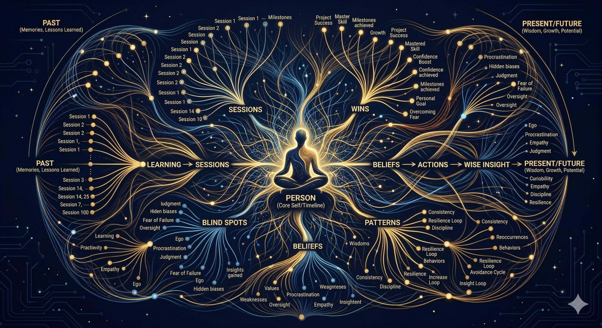

<h1 align="center">🧠 Claude Coach</h1>

<p align="center">
  
</p>

<p align="center">
  <strong>Your AI coaching agent that actually remembers you.</strong><br>
  Built on <a href="https://claude.ai/code">Claude Code</a> · Identity-level coaching · Persistent memory across sessions
</p>

<p align="center">
  <a href="https://www.linkedin.com/in/liam-obrien/">LinkedIn</a> ·
  <a href="https://x.com/liamlive">X</a> ·
  <a href="https://github.com/liamodev/">GitHub</a> ·
  <a href="https://www.altitude7.com/">Altitude7</a>
</p>

<p align="center">
  <a href="#-quick-start">Quick Start</a> ·
  <a href="#-how-the-memory-works">How It Works</a> ·
  <a href="#-what-makes-this-different-from-a-chatbot">Why It's Different</a> ·
  <a href="#-contributing">Contribute</a>
</p>

---

> *"After a dozen sessions, it surfaced a pattern I'd been blind to for months. It had been watching. It remembered everything."*

**Not a chatbot. A coach.**

It challenges your thinking. It surfaces uncomfortable truths. It holds you accountable to what you said mattered most. And it never forgets a single session.

---

## ❌ The Problem

Ask any AI for coaching and you'll get frameworks, bullet points, and validation.

It won't remember what you said last week. It won't notice you've avoided the same conversation three times. It won't ask why you're still not doing the thing you said mattered most.

## ✅ The Solution

Claude Coach was built to change that.

Every session reads your goals, your profile, your coaching history, and your open commitments. It doesn't start from zero. It doesn't forget. It builds a model of who you are across months — your blind spots, your patterns, your values, your limiting beliefs — and uses that to coach you, not interrogate you.

The accountability is structural. Commitments live in a file with due dates. They surface at the start of every session. There's no friction-free way to let something slide.

---

## 🎬 See It in Action

> 📱 **Mobile tip:** Start a session on desktop, then run `/remote` — Claude Code serves it over your local network. Use speech-to-text on your phone to coach on the go. No app needed.

> 🎥 Demo GIF coming soon — contributions welcome.

---

## 📋 Prerequisites

You need [Claude Code](https://claude.ai/code) installed.

```bash
npm install -g @anthropic-ai/claude-code
```

That's it. Claude Code is Anthropic's official CLI — it runs Claude in your terminal with access to your local files, which is what gives this system its persistent memory.

---

## 🚀 Quick Start

**1️⃣ Clone this repo and open the folder in Claude Code**

```bash
git clone https://github.com/liamodev/claude-coach.git
cd claude-coach
claude
```

**2️⃣ Run `/onboard`**

Claude interviews you and populates `profile.yaml` and `goals.yaml`. Have any supporting context ready to paste — resume, business plan, job description, whatever's relevant. Takes about 10 minutes.

**3️⃣ (Optional) Activate the example framework**

An original Founder Clarity Framework is included at `frameworks/example-founder-clarity/`. It covers vision, decision-making, energy, and beliefs — ready to use immediately.

To activate: copy the contents up to `frameworks/` per the instructions in `frameworks/example-founder-clarity/README.md`. Or build your own with `/buildframework`.

**4️⃣ Run `/start` to begin your first session**

---

## ⚡ Commands

| Command | When | What it does |
|---------|------|-------------|
| 🟢 `/onboard` | Once, first time | Structured interview — populates `profile.yaml` and `goals.yaml`. Captures identity, values, beliefs, vision, goals, challenges, and your coaching contract. |
| 🔧 `/buildframework` | Any time — optional | Builds a coaching framework from any source: book, podcast, methodology, AI-generated content. Creates guide files and an index. Can extend an existing framework. |
| 🎯 `/start` | Every session | Reads all context files. Opens with check-in, surfaces a win, flags overdue accountability. |
| 📝 `/session` | End of every session | Captures insights, anchors wins to identity, updates goals/profile/accountability/coach-notes. Nothing written without your confirmation. |

---

## 🧠 How the Memory Works

This is a **seven-layer system**. Each layer feeds the next.

### 🏛️ Layer 0 — Coaching Methodology

> `mastercoach/MasterCoach.md`

The foundational standard. Defines how to coach — philosophy, methodology, skills. Read at the start of every session. Not improvised; it's a standard.

| Principle | What it means |
|-----------|--------------|
| 🌱 **The client is not broken** | Whole, capable, and resourceful |
| 🔄 **Identity > Behavior** | Behavior change is temporary; identity change is permanent |
| 👂 **Level 3 Listening** | What's *not* said matters as much as what is |
| ⚖️ **Champion/Challenger dial** | Calibrated precisely, not flat pressure |
| 🏆 **Wins & Gains** | High achievers skip this; the system interrupts that pattern |
| 🎯 **Make yourself obsolete** | Build self-coaching capacity over time |

---

### ⚙️ Layer 1 — Operating Rules

> `CLAUDE.md`

Claude's coaching manual. Defines role, guardrails, coaching modes, and always-on responsibilities.

- Default posture: **Awareness → Restructuring → Commitment & Capacity**
- Six coaching modes inferred automatically (Strategy, Accountability, Problem-Solve, Reflect, Explore, Plan)
- Champion/Challenger dial — reads the situation, doesn't just "push hard"
- Stalled goals (14+ days no movement) surfaced proactively — not silently decayed

> 💡 **Explore mode** suspends the challenge mandate. Invoke with *"explore"* or *"just thinking out loud."*

---

### 💾 Layer 2 — Long-Term Memory

These files build over time. Read at the start of every session.

#### 💖 `core/profile.yaml` — The heartbeat of the system

What makes this feel like a real coach who knows their client:

| What it tracks | Details |
|---------------|---------|
| 🪪 **Identity** | Name, location, timezone |
| 🪞 **Self-concept** | Current identity and emerging identity ("I am the kind of person who...") |
| 💎 **Values** | Core values and what they mean in practice |
| 🔓 **Beliefs** | Limiting beliefs (active/shifting/resolved) and empowering beliefs being built |
| 📖 **Background** | Professional history, founder story, career context |
| 🔍 **Patterns** | Strengths, blind spots (with recurrence count), recurring themes |
| 🧬 **Wiring** | Personality assessments (CliftonStrengths, DISC, Enneagram, etc.) |
| ⚡ **Energy** | Energizers, drains, peak working time |
| 🏆 **Wins** | With `identity_reveal` field: what each win says about who they are |
| 🧗 **Challenges** | Raised, resolved, and how |
| 🔭 **Vision** | Long-term direction and purpose |
| 🤝 **Key relationships** | Who influences decisions, sources of support and drag |

> Every entry is dated. Context builds across **months**, not just sessions.

#### 📊 `core/goals.yaml` — Source of truth for active goals

Priority ranking · Progress % · Status tracking · Key results with due dates · Decision context

> ⚠️ Goals never silently stall. Fourteen-plus days without movement and Claude names it.

#### ✅ `core/accountability.md` — Every commitment, tracked

Every commitment made in a session lands here with a due date. Surfaced at `/start`. Nothing slides without being named.

#### 📓 `core/coach-notes.md` — The coaching journal

Claude's private observations across sessions. Written like a coach's notebook — what surfaced, how it was said, what it revealed, what to watch. This is where pattern recognition lives between sessions.

---

### 🔄 Layer 3 — Short-Term Memory

At `/start`, Claude synthesizes the long-term files into live working context: what's on track, what's overdue, what patterns have been surfacing, where you are in the workbook. Re-synthesized fresh every session.

---

### 📚 Layer 4 — Optional Coaching Framework

Drop in any book, program, or methodology. The system supports:

- 📖 **Guides** (`frameworks/guides/`) — specific tools Claude pulls into sessions when a topic arises
- 🗂️ **A guide index** (`frameworks/guides_index.md`) — lookup table Claude reads to find the right guide
- ✍️ **A workbook** (`frameworks/framework-workbook.md`) — questions worked through progressively over time

> 🎁 **Included:** An example Founder Clarity Framework at `frameworks/example-founder-clarity/` — covers vision, decisions, energy, and beliefs. Fully original, ready to use on day one.

See `frameworks/README.md` for how to build your own from any source material.

---

### 📄 Layer 5 — Session Capture

> `sessions/YYYY-MM-DD.md`

One markdown file per session, created at `/session` close:

```
# Session — YYYY-MM-DD

## Topics Covered
## Key Insights
## Decisions
## Commitments (What | Owner | Due)
## Open Questions
## Goals Updated
## Profile Updated
```

---

### 🎮 Layer 6 — Commands

#### 🎯 `/start` — Begin a Session

1. Read all context files (methodology, goals, profile, accountability, coach-notes)
2. Read workbook if it exists
3. Identify overdue commitments and those due within 7 days
4. Open in 2–4 sentences:
   - 💬 **Check-in** — one question on energy/mindset
   - 🏆 **Wins & Gains** — surface a win before anything else (non-negotiable)
   - ⚠️ **Accountability** if anything is overdue — direct, no softening
   - 📖 **Workbook question** if no urgency
   - 🚪 **Open door** — "What's on your mind today?"

#### 📝 `/session` — Close a Session

| Step | What happens |
|------|-------------|
| 1 — 📋 Session Summary | Topics, insights, decisions, commitments, open questions |
| 1b — 🏆 Wins & Gains | Name wins; anchor to identity; write to profile with `identity_reveal` |
| 2 — 📊 Goals Update | Progress %, milestones, status changes, new goals |
| 2b — ✍️ Workbook Update | Record answers, update status markers |
| 3 — 🪞 Profile Update | New context, patterns, beliefs, values, self-concept shifts |
| 4 — 📄 Session File | Create `./sessions/YYYY-MM-DD.md` |
| 5 — ✅ Accountability Update | Mark complete, carry forward, add new |
| 5b — 📓 Coach Notes | Narrative journal entry on what surfaced |

> 🔒 Nothing gets written without your confirmation.

---

## 📁 Directory Structure

```
.
├── CLAUDE.md                          # 📋 Claude's coaching operating manual
├── README.md                          # 📖 This file
├── mastercoach/
│   └── MasterCoach.md                 # 🏛️ Foundational coaching methodology — read-only
│
├── core/
│   ├── profile.yaml                   # 💖 Your evolving context and history (the heartbeat)
│   ├── goals.yaml                     # 📊 Active goals and milestones
│   ├── accountability.md              # ✅ Active commitments with due dates
│   └── coach-notes.md                 # 📓 Rolling coach journal across sessions
│
├── sessions/
│   └── YYYY-MM-DD.md                  # 📄 One file per coaching session
│
├── frameworks/
│   ├── README.md                      # 📖 How to add your own framework
│   ├── example-founder-clarity/       # 🎁 Ready-to-use example framework
│   ├── framework-workbook.md          # ✍️ Your workbook answers (if using one)
│   ├── guides_index.md                # 🗂️ Lookup table for guides
│   └── guides/                        # 📚 Individual guide files
│
└── .claude/
    └── commands/
        ├── onboard.md                 # 🟢 /onboard
        ├── buildframework.md          # 🔧 /buildframework
        ├── start.md                   # 🎯 /start
        └── session.md                 # 📝 /session
```

---

## 🔐 Your Data Stays Local

All session data lives in your local files — nothing is sent anywhere beyond your Claude API calls. `core/profile.yaml`, session files, and coach notes are **gitignored by default** to prevent accidental exposure.

> 💡 **Want to back up to a private repository?** That's encouraged. Edit `.gitignore` to include those files and push to a private repo. Just don't push personal coaching data to a public repo.

---

## 📅 What Gets Updated and When

| File | Updated by | Trigger |
|------|-----------|---------|
| 📊 `core/goals.yaml` | `/session` Step 2 | Progress discussed, milestone hit, new goal set |
| 💖 `core/profile.yaml` | `/session` Steps 1b + 3 | Wins, beliefs, values, self-concept shifts, patterns |
| ✅ `core/accountability.md` | `/session` Step 5 | New commitments; old ones resolved |
| ✍️ `frameworks/framework-workbook.md` | `/session` Step 2b | Workbook questions answered |
| 📓 `core/coach-notes.md` | `/session` Step 5b | End of every substantive session |
| 📄 `sessions/YYYY-MM-DD.md` | `/session` Step 4 | End of every session |

> Nothing is written mid-session. Claude observes silently — like a coach writing in their notebook. At `/session` close, all changes are presented in one batch review.

---

## 🔥 What Makes This Different from a Chatbot

🏛️ **A real coaching standard.** `MasterCoach.md` defines the methodology — Level 3 Listening, Champion/Challenger calibration, identity-level coaching. Not improvised; not generic.

🧠 **Memory builds.** After 10 sessions, Claude knows your wiring, your blind spots, your limiting beliefs, your patterns. That context doesn't reset.

✅ **Accountability is structural.** Commitments live in a file with due dates. `/start` surfaces them at the top of every session. Nothing slides without being named.

🔍 **Pattern recognition persists.** `coach-notes.md` accumulates observations. Recurring themes are named and tracked — not forgotten after one session.

📚 **The framework is yours.** Drop in any program, book, or methodology. The system coaches from your material directly.

⚖️ **The coach role is enforced.** `CLAUDE.md` holds Claude to a standard: challenge, don't validate; recommend, don't summarize; close decisions, don't reopen them; name conflicts, don't soften them.

---

## 🤝 Contributing

Pull requests welcome! Especially interested in:
- 📚 Example frameworks (original content only — no copyrighted material)
- 🏛️ Improvements to the MasterCoach methodology
- ⚡ New slash commands
- 🟢 Better onboarding flow

---

## 👤 Built By

**Liam OBrien** — founder, builder, Claude Code enthusiast.

[LinkedIn](https://www.linkedin.com/in/liam-obrien/) · [X / Twitter](https://x.com/liamlive) · [GitHub](https://github.com/liamodev/) · [Altitude7](https://www.altitude7.com/)

⭐ If this is useful to you, **a star goes a long way**. And if you build something interesting on top of it, reach out.

---

*Built on [Claude Code](https://claude.ai/code) — Anthropic's official CLI.*
